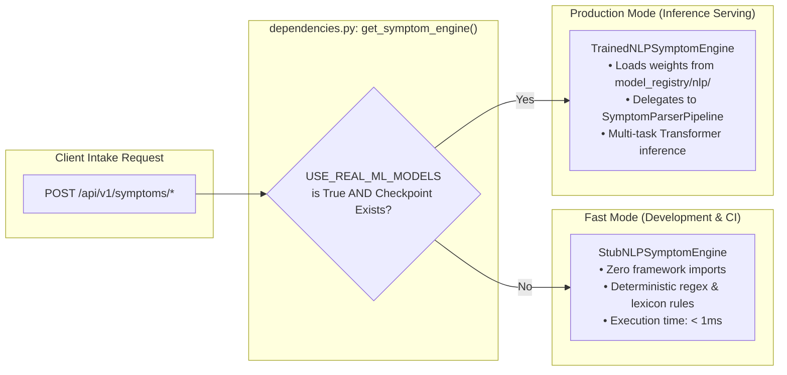
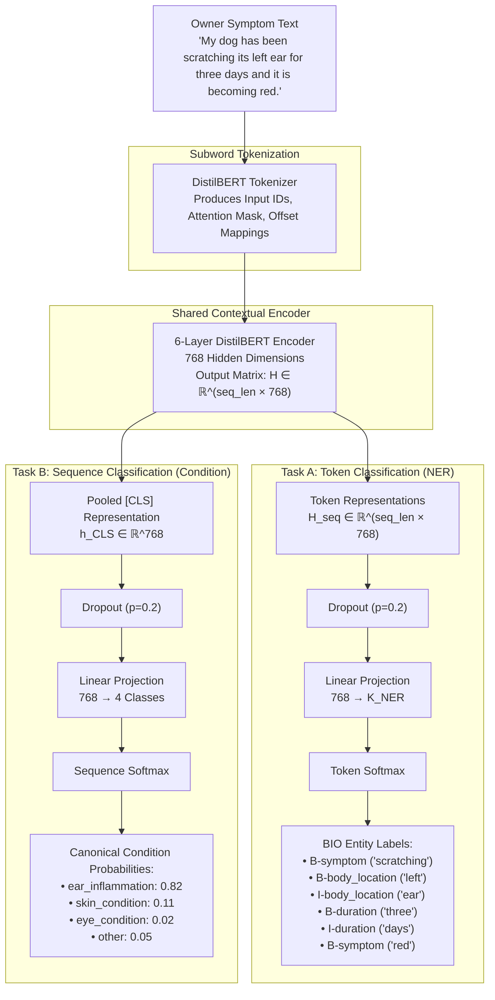
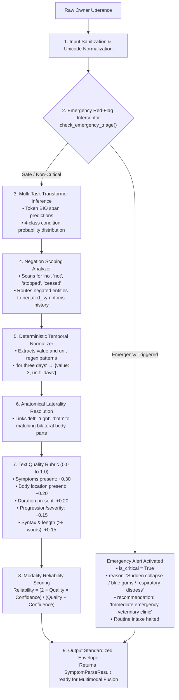
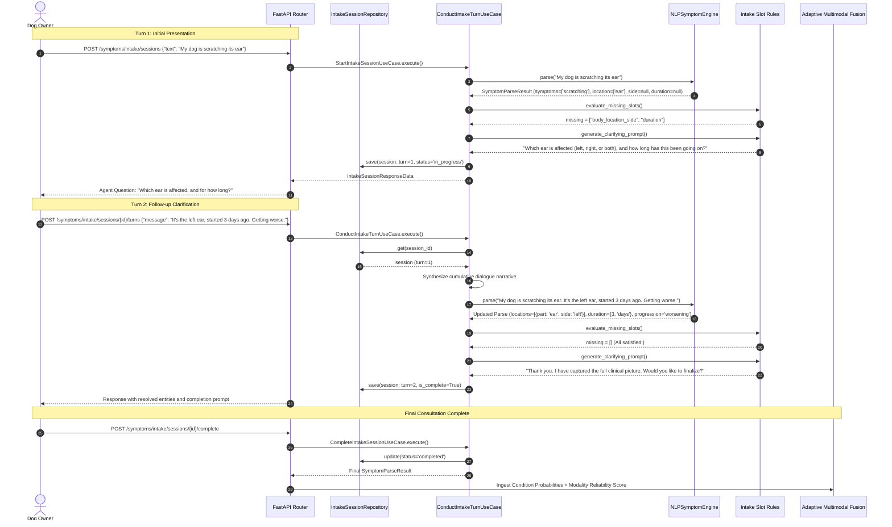
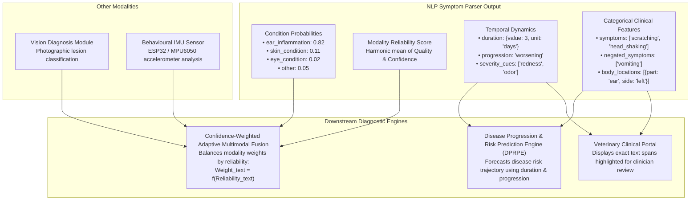

# Canine Disease NLP Architecture & Process Flow Blueprint

This document specifies the technical architecture, neural network design, end-to-end data transformation pipeline, and conversational state machine for the **Canivue Canine Disease NLP Symptom Parser & Intake Agent**.

---

## 🏛️ 1. Clean Architecture System Structure

The NLP module is organized into **Feature-Based Clean Architecture** inside a **Modular Monolith**. It adheres to the **Inward Dependency Rule**: outer layers depend on inner layers, and the Domain layer has zero framework dependencies.

```mermaid
graph TB
    subgraph Presentation ["1. Presentation Layer (HTTP / REST)"]
        Router["router.py<br/>• POST /symptoms/parse<br/>• POST /symptoms/intake/sessions<br/>• POST /symptoms/intake/sessions/{id}/turns<br/>• POST /symptoms/intake/sessions/{id}/complete"]
        Schemas["schemas.py<br/>• SymptomParseRequest / Response<br/>• StartIntakeRequest<br/>• IntakeTurnRequest"]
        Deps["dependencies.py<br/>• get_symptom_engine()<br/>• get_intake_session_repository()<br/>• Use Case Providers"]
    end

    subgraph Application ["2. Application Layer (Use Cases & DTOs)"]
        ParseUC["ParseSymptomTextUseCase<br/>Single-turn parsing coordinator"]
        StartUC["StartIntakeSessionUseCase<br/>Session initialization & slot extraction"]
        TurnUC["ConductIntakeTurnUseCase<br/>Multi-turn context synthesis"]
        CompleteUC["CompleteIntakeSessionUseCase<br/>Final evidence freeze"]
        DTOs["dtos.py<br/>• ParseSymptomInputDTO / OutputDTO<br/>• StartIntakeInputDTO / OutputDTO<br/>• ConductTurnInputDTO"]
    end

    subgraph Domain ["3. Domain Layer (Pure Business Core)"]
        Entities["entities.py<br/>• SymptomParseResult<br/>• IntakeSession & IntakeMessage<br/>• BodyLocation, DurationEntity, ExtractedSpan"]
        Protocols["repositories.py (Protocols)<br/>• NLPSymptomEngineProtocol<br/>• IntakeSessionRepositoryProtocol"]
        Rules["intake_rules.py<br/>• evaluate_missing_slots()<br/>• generate_clarifying_prompt()"]
        Exceptions["exceptions.py<br/>• EmptySymptomTextException<br/>• IntakeSessionNotFoundException<br/>• IntakeSessionClosedException"]
    end

    subgraph Infrastructure ["4. Infrastructure Layer (Adapters & Serving)"]
        SessionRepo["session_repository.py<br/>InMemoryIntakeSessionRepository"]
        ServingEngines["ml/engine.py<br/>• StubNLPSymptomEngine (Fast CI/tests)<br/>• TrainedNLPSymptomEngine (PyTorch inference)"]
        Preproc["ml/preprocessing.py<br/>• check_emergency_triage()<br/>• calculate_text_quality_score()<br/>• calculate_modality_reliability()"]
    end

    subgraph MachineLearning ["5. Machine Learning Core (ml/nlp/)"]
        Pipeline["pipeline.py<br/>SymptomParserPipeline"]
        MultiTask["model.py<br/>MultiTaskSymptomTransformer"]
        TrainEval["train.py & evaluate.py<br/>• Dog-level splitting (pet_id)<br/>• Macro-F1 across 4 conditions<br/>• Expected Calibration Error (ECE)"]
    end

    %% Dependency Arrows
    Router --> Schemas
    Router --> Deps
    Router --> ParseUC
    Router --> StartUC
    Router --> TurnUC
    Router --> CompleteUC

    ParseUC --> Protocols
    ParseUC --> DTOs
    StartUC --> Protocols
    StartUC --> Rules
    StartUC --> DTOs
    TurnUC --> Protocols
    TurnUC --> Rules
    TurnUC --> DTOs
    CompleteUC --> Protocols
    CompleteUC --> DTOs

    ServingEngines -.->|implements| Protocols
    SessionRepo -.->|implements| Protocols
    TrainedEngine --> Pipeline
    Pipeline --> MultiTask
    Pipeline --> Preproc
```

> [!NOTE]
> **Zero ML Framework Leakage:** `torch` and `transformers` are isolated entirely inside `infrastructure/ml/engine.py` and `ml/nlp/`. The application and domain layers depend solely on [`NLPSymptomEngineProtocol`](file:///c:/Users/indun/OneDrive/Desktop/canivue-api/app/features/symptom_nlp/domain/repositories.py).

---

## ⚡ 2. Dual-Engine Serving Topology

To guarantee that unit tests, local development, and CI execute in milliseconds without requiring GPUs or gigabyte model downloads, the application employs a **Dual-Engine Pattern**:

---

## 🧠 3. Multi-Task Neural Network Architecture

The neural core in [`MultiTaskSymptomTransformer`](file:///c:/Users/indun/OneDrive/Desktop/canivue-api/ml/nlp/model.py) uses a **single shared Transformer backbone** with **two concurrent prediction heads**.

### Multi-Task Loss Formulation
During offline training ([`ml/nlp/train.py`](file:///c:/Users/indun/OneDrive/Desktop/canivue-api/ml/nlp/train.py)), both heads are optimized simultaneously with loss weighting:
$$\mathcal{L}_{\text{total}} = 0.6 \cdot \mathcal{L}_{\text{NER}}(\text{CrossEntropy}) + 0.4 \cdot \mathcal{L}_{\text{condition}}(\text{CrossEntropy})$$

---

## 🔄 4. End-to-End Symptom Processing Pipeline

The following flowchart details the sequential stages that an input string passes through:

---

## 💬 5. Conversational Clinical Intake Agent Process Flow

When an owner engages in a multi-turn consultation, the agent coordinates context accumulation and targeted clarifying prompt generation:

---

## 🔀 6. Integration with Multimodal Fusion & DPRPE

The NLP module acts as a **clinical evidence translator** for the other canine diagnostic engines:

---

## 📊 Summary of Architectural Guarantees

| Capability | Architectural Seam | Verification Method |
|---|---|---|
| **Stateless Single-Turn Parsing** | `POST /api/v1/symptoms/parse` | Tested via `test_api.py` with schema and span validation |
| **Multi-Turn Clinical Intake** | `POST /api/v1/symptoms/intake/*` | Tested via `test_intake_api.py` across full dialogue turns |
| **Emergency Triage Red-Flag** | `check_emergency_triage()` | Immediate diversion tested on Turn 1 and Turn $N$ |
| **Zero-GPU Testing Discipline** | `StubNLPSymptomEngine` | Executed in CI without GPU drivers or network access |
| **Leak-Free ML Dataset** | `get_dog_level_splits(pet_id)` | Tested in `test_nlp_pipeline.py` preventing patient overlap |
